# Prompt-Stack Decision Tree

## 🚀 Starting Fresh - Your Journey Begins Here

You've just cloned prompt-stack-skeleton. This guide will help you make the right decisions for your project.

```mermaid
graph TD
    Start[Just Cloned Repo] --> FirstRun{First Decision:<br/>How to Start?}
    
    FirstRun -->|Just Explore| DemoPath[Demo Mode<br/>Zero Config]
    FirstRun -->|Building Real App| ConfigPath[Configuration<br/>Decisions]
    
    DemoPath --> DemoStart[make dev]
    DemoStart --> DemoWorks[✅ Everything Works!<br/>- Mock auth<br/>- Demo AI responses<br/>- Test UI]
    
    ConfigPath --> Q1{Do you have<br/>AI API keys?}
```



## Decision Path 1: Quick Start (Demo Mode)


**Commands:**
```bash
# Start everything in demo mode
make dev

# Access at:
# - Frontend: http://localhost:3000
# - Backend: http://localhost:8000
# - API Docs: http://localhost:8000/docs
```

## Decision Path 2: Progressive Configuration


## 🤖 AI Configuration Decision Tree


### AI Provider Comparison

| Provider | Best For | Models | Cost | Speed |
|----------|----------|--------|------|-------|
| OpenAI | General purpose, Tools | GPT-4o, GPT-4o-mini | $$$ | Fast |
| Anthropic | Code, Analysis, Writing | Claude 3 Opus/Sonnet | $$$ | Fast |
| Google | Multimodal, Long context | Gemini 2.5 Pro/Flash | $$ | Very Fast |
| DeepSeek | Reasoning, Cost-effective | Chat, Reasoner | $ | Fast |

## 🔐 Authentication Decision Tree

```mermaid
graph TD
    AuthStart{Authentication<br/>Needs?} --> NoAuth[No Auth Needed]
    AuthStart --> SimpleAuth[Simple Auth]
    AuthStart --> FullAuth[Production Auth]
    
    NoAuth --> DemoAuth[Use Demo Mode<br/>DEMO_MODE=true]
    
    SimpleAuth --> BasicSupabase[Basic Supabase<br/>Email/Password only]
    
    FullAuth --> FullSupabase[Full Supabase<br/>+ OAuth providers<br/>+ Row Level Security<br/>+ User profiles]
    
    BasicSupabase --> SupaSetup[1. Create Supabase project<br/>2. Add keys to .env<br/>3. Run migrations]
    FullSupabase --> SupaSetup
    
    SupaSetup --> AuthWorks[✅ Real user accounts!]
```



### Authentication Setup Steps

#### Option 1: Stay with Demo Auth
```bash
# No changes needed! Already configured
# backend/.env
DEMO_MODE=true

# frontend/.env.local  
NEXT_PUBLIC_DEMO_MODE=true
```

#### Option 2: Enable Supabase Auth
```bash
# 1. Create project at supabase.com
# 2. Add to backend/.env
DEMO_MODE=false
SUPABASE_URL=https://xxx.supabase.co
SUPABASE_ANON_KEY=eyJ...
SUPABASE_SERVICE_ROLE_KEY=eyJ...

# 3. Add to frontend/.env.local
NEXT_PUBLIC_DEMO_MODE=false
NEXT_PUBLIC_SUPABASE_URL=https://xxx.supabase.co
NEXT_PUBLIC_SUPABASE_ANON_KEY=eyJ...

# 4. Restart everything
make clean && make dev
```

## 🎯 Common Scenarios - What Should You Choose?

### Scenario 1: "I'm Learning/Exploring"
```
✅ Use: Demo mode everything
❌ Skip: All API keys and configuration
🚀 Start: make dev
```

### Scenario 2: "Building a Hackathon Project"
```
✅ Use: Demo mode + 1 AI provider (OpenAI)
❌ Skip: Authentication, Payments
🚀 Start: Add OpenAI key → make dev
```

### Scenario 3: "Building an MVP"
```
✅ Use: Supabase auth + 2 AI providers
❌ Skip: Payments (add later)
🚀 Start: Configure Supabase + AI → make dev
```

### Scenario 4: "Production SaaS"
```
✅ Use: Everything - auth, all AI, payments
✅ Add: Monitoring, error tracking
🚀 Start: Full configuration → deploy
```

## 📋 Configuration Checklist

### Minimal Production Setup
- [ ] 1 AI provider key (OpenAI recommended)
- [ ] Supabase project + keys
- [ ] Environment set to production
- [ ] Basic error handling

### Full Production Setup  
- [ ] Multiple AI provider keys
- [ ] Supabase with RLS policies
- [ ] Payment provider (Stripe/LS)
- [ ] Error tracking (Sentry)
- [ ] Analytics
- [ ] Monitoring
- [ ] Backups

## 🔄 Migration Paths

### From Demo → Production
1. **Keep your code**: No code changes needed!
2. **Add API keys**: Start with one provider
3. **Enable auth**: Add Supabase keys
4. **Gradual migration**: Features auto-detect configuration

### From Single Provider → Multi-Provider
1. **Add new keys**: Just add to .env
2. **Auto-detection**: UI updates automatically
3. **No code changes**: Provider abstraction handles it

### From Local → Deployed
1. **Choose platform**: Vercel, Railway, etc.
2. **Set env vars**: Same keys, production values
3. **Update URLs**: API URL in frontend config
4. **Deploy**: Push to platform

## ⚡ Quick Reference Commands

```bash
# Start fresh
git clone <repo>
cd prompt-stack-skeleton
cp backend/.env.example backend/.env
cp frontend/.env.example frontend/.env.local

# Run in demo mode (default)
make dev

# Add first AI provider
echo "OPENAI_API_KEY=sk-..." >> backend/.env
make restart-backend

# Switch to production auth
# Edit both .env files: DEMO_MODE=false
make clean && make dev

# Test everything
./scripts/test-api-simple.sh

# View logs
make logs

# Stop everything
make down
```

## 🎨 Your Journey Map

```
Day 1:  Clone → Demo Mode → Explore
Day 2:  Add OpenAI key → Test real AI
Day 3:  Add Supabase → Real users
Day 7:  Add more providers → Compare
Day 14: Add payments → Monetize
Day 30: Deploy → Production! 🚀
```

## Need Help?

1. **Demo not working?** → Check Docker is running
2. **AI not responding?** → Verify API key format
3. **Auth errors?** → Ensure keys match between frontend/backend
4. **Something else?** → Check /docs folder or GitHub issues

---

Remember: Start simple, enhance progressively. The system grows with you! 🌱