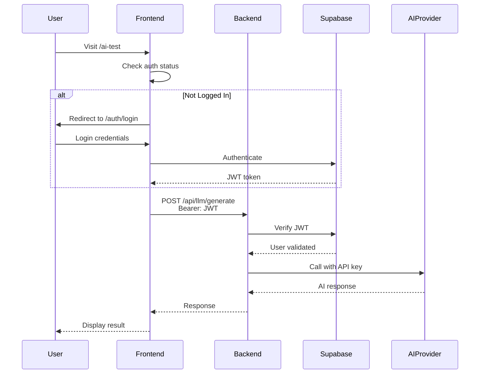

# Authentication + AI Setup Guide

## Current Behavior

With the current setup (`DEMO_MODE=true`), you get:
- ✅ All AI providers working
- ✅ No login required
- ⚠️ Mock authentication only
- ⚠️ No data persistence

## To Enable Full Production Mode

### 1. Update Backend Configuration

Edit `backend/.env`:
```bash
# Change from true to false
DEMO_MODE=false

# Ensure Supabase is configured
SUPABASE_URL=https://your-project.supabase.co
SUPABASE_ANON_KEY=your-anon-key
SUPABASE_SERVICE_ROLE_KEY=your-service-key
```

### 2. Update Frontend Configuration

Edit `frontend/.env.local`:
```bash
# Change from true to false
NEXT_PUBLIC_DEMO_MODE=false

# Ensure Supabase is configured
NEXT_PUBLIC_SUPABASE_URL=https://your-project.supabase.co
NEXT_PUBLIC_SUPABASE_ANON_KEY=your-anon-key
```

### 3. Restart Services

```bash
# Recreate containers to load new env vars
make clean
make dev
```

### 4. Database Setup

Run migrations if not already done:
```bash
# The initial schema includes users, profiles, etc.
# Check supabase/migrations/001_initial_schema.sql
```

## How It Works in Production Mode



## Authentication Methods Available

### 1. Email/Password (Default)
- Users sign up with email
- Supabase handles verification
- Passwords securely hashed

### 2. OAuth Providers (Configurable)
- Google
- GitHub  
- Discord
- [Configure in Supabase dashboard]

### 3. Magic Links
- Passwordless authentication
- Email-based login links
- [Enable in Supabase settings]

## Testing the Flow

### 1. Sign Up
```bash
curl -X POST http://localhost:8000/api/auth/register \
  -H "Content-Type: application/json" \
  -d '{
    "email": "test@example.com",
    "password": "testpass123"
  }'
```

### 2. Sign In
```bash
curl -X POST http://localhost:8000/api/auth/login \
  -H "Content-Type: application/json" \
  -d '{
    "email": "test@example.com",
    "password": "testpass123"
  }'
```

### 3. Use AI with Auth Token
```bash
# Get token from login response
TOKEN="eyJ..."

curl -X POST http://localhost:8000/api/llm/generate \
  -H "Content-Type: application/json" \
  -H "Authorization: Bearer $TOKEN" \
  -d '{
    "prompt": "Hello!",
    "provider": "openai",
    "model": "gpt-4o-mini"
  }'
```

## Troubleshooting

### "401 Unauthorized" Errors
- Check if JWT token is valid
- Ensure Supabase keys match between frontend/backend
- Verify DEMO_MODE=false in both environments

### "Supabase not configured" 
- Add all required Supabase keys
- Restart containers after adding keys
- Check keys are from same project

### AI Works in Demo but Not Production
- Frontend must use `/api/llm/generate` not `/api/llm/demo`
- Must include Bearer token in requests
- Check browser console for auth errors

## Benefits of Production Mode

1. **User Management**: Real accounts, profiles, preferences
2. **Data Persistence**: Save conversations, settings
3. **Rate Limiting Per User**: Track usage by account
4. **Audit Trail**: Log who used which models
5. **Cost Attribution**: Track API costs per user
6. **Access Control**: Limit models by user tier

## Hybrid Approach

You can also run a hybrid where:
- Public pages use demo endpoints
- Logged-in users use authenticated endpoints
- Graceful fallback if auth fails

This gives the best of both worlds!