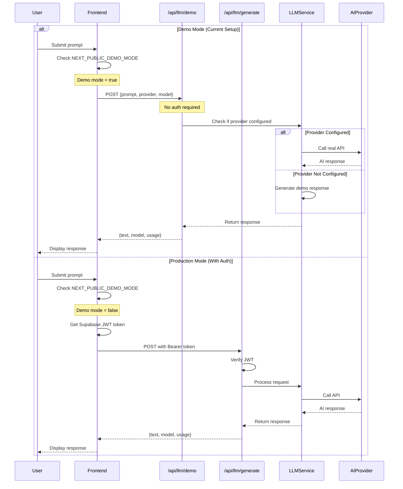
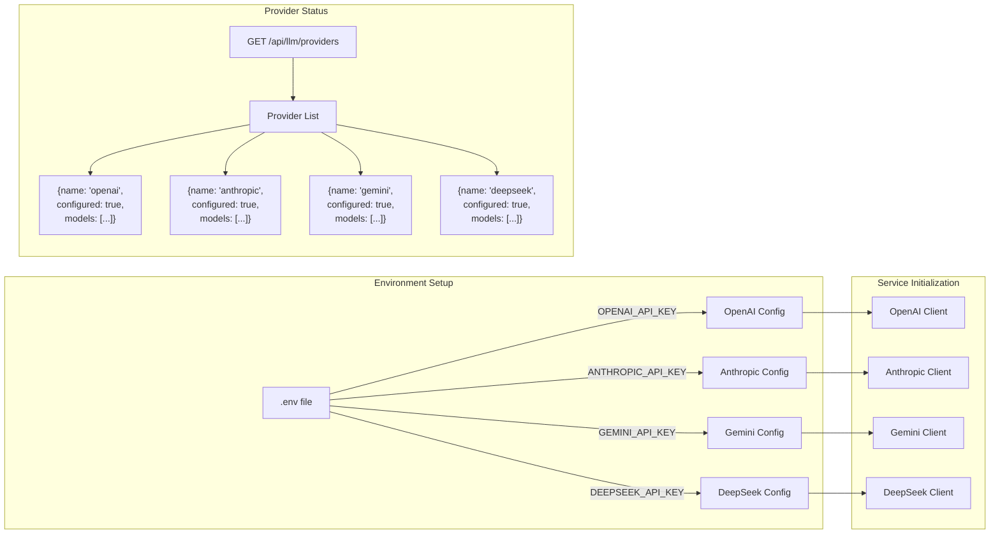
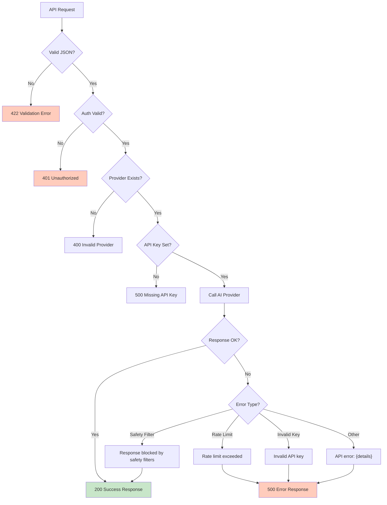

# LLM System Architecture

## Complete Flow Diagram

```mermaid
graph TB
    subgraph "Frontend (Next.js)"
        UI[AI Test Page<br/>localhost:3000/ai-test]
        LLMService[llm.ts Service]
        AuthCheck{Demo Mode?}
        
        UI -->|User submits prompt| LLMService
        LLMService --> AuthCheck
    end
    
    subgraph "Environment Variables"
        FrontEnv[NEXT_PUBLIC_DEMO_MODE=true<br/>NEXT_PUBLIC_SUPABASE_URL]
        BackEnv[DEMO_MODE=true<br/>API Keys configured]
    end
    
    subgraph "API Endpoints"
        AuthCheck -->|Yes| DemoEndpoint["/api/llm/demo"<br/>No auth required]
        AuthCheck -->|No| GenerateEndpoint["/api/llm/generate"<br/>Requires JWT token]
        ProvidersEndpoint["/api/llm/providers"<br/>Lists available providers]
    end
    
    subgraph "Backend (FastAPI)"
        DemoHandler[demo_generate()<br/>Allows real providers]
        GenerateHandler[generate_text()<br/>Requires authentication]
        ProviderCheck{Provider<br/>Configured?}
        
        DemoEndpoint --> DemoHandler
        GenerateEndpoint --> GenerateHandler
        DemoHandler --> ProviderCheck
        GenerateHandler --> ProviderCheck
    end
    
    subgraph "LLM Service Layer"
        LLMServiceBackend[llm_service.py]
        ProviderRouter{Route by Provider}
        
        ProviderCheck -->|Yes| LLMServiceBackend
        ProviderCheck -->|No| DemoProvider
        LLMServiceBackend --> ProviderRouter
    end
    
    subgraph "AI Providers"
        OpenAI[OpenAI API<br/>GPT-4o, GPT-4o-mini]
        Anthropic[Anthropic API<br/>Claude Opus/Sonnet/Haiku]
        Gemini[Google Gemini API<br/>2.5-pro, 2.5-flash<br/>2.0-flash, 1.5-pro, 1.5-flash]
        DeepSeek[DeepSeek API<br/>chat, reasoner]
        DemoProvider[Demo Provider<br/>Mock responses]
        
        ProviderRouter -->|provider=openai| OpenAI
        ProviderRouter -->|provider=anthropic| Anthropic
        ProviderRouter -->|provider=gemini| Gemini
        ProviderRouter -->|provider=deepseek| DeepSeek
        ProviderRouter -->|provider=demo| DemoProvider
    end
    
    subgraph "Response Flow"
        Response[Formatted Response<br/>text, model, usage]
        SafetyHandler[Safety Filter Handler<br/>For Gemini]
        
        OpenAI --> Response
        Anthropic --> Response
        Gemini --> SafetyHandler
        SafetyHandler --> Response
        DeepSeek --> Response
        DemoProvider --> Response
    end
    
    Response --> DemoHandler
    Response --> GenerateHandler
    DemoHandler --> UI
    GenerateHandler --> UI
    
    FrontEnv -.->|Configures| AuthCheck
    BackEnv -.->|Configures| ProviderCheck
    
    style UI fill:#e1f5fe
    style DemoEndpoint fill:#c8e6c9
    style GenerateEndpoint fill:#ffccbc
    style OpenAI fill:#74aa9c
    style Anthropic fill:#9c74aa
    style Gemini fill:#aa9c74
    style DeepSeek fill:#aa7497
    style DemoProvider fill:#d0d0d0
```

## Authentication Flow



## Provider Configuration Flow



## Error Handling Flow



## Component Details

### Frontend Components
- **AI Test Page**: `/frontend/app/ai-test/page.tsx`
- **LLM Service**: `/frontend/services/llm.ts`
- **Auth Provider**: `/frontend/components/providers/auth-provider.tsx`

### Backend Components
- **LLM Endpoints**: `/backend/app/api/endpoints/llm.py`
- **LLM Service**: `/backend/app/services/llm_service.py`
- **Config**: `/backend/app/core/config.py`
- **Models**: `/backend/app/models/llm.py`

### Key Features
1. **Dual Mode Support**: Demo mode for testing, Production mode with auth
2. **Multi-Provider**: Supports 4 AI providers + demo fallback
3. **Safety Handling**: Graceful handling of Gemini safety filters
4. **Token Tracking**: Usage statistics for all providers (except Gemini)
5. **Rate Limiting**: 10 req/min (demo), 30 req/min (authenticated)

## Model Availability

| Provider | Models | Default |
|----------|--------|---------|
| OpenAI | o3, gpt-4o, gpt-4o-mini | gpt-4o-mini |
| Anthropic | claude-opus-4, claude-sonnet-4, claude-3-5-haiku | claude-3-5-haiku |
| Gemini | 2.5-pro, 2.5-flash, 2.0-flash, 1.5-pro, 1.5-flash | gemini-2.5-flash |
| DeepSeek | deepseek-chat, deepseek-reasoner | deepseek-chat |
| Demo | demo | demo |